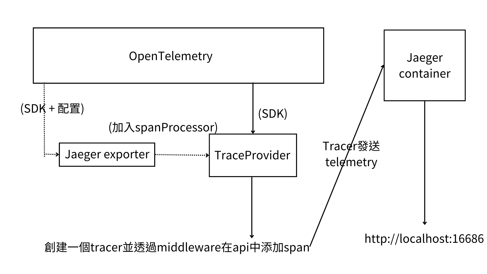

# 使用OpenTelemetry發送telemetry到Jaeger
---
## 架構


## TraceProvider的架構
* TraceProvider由opentelemetry的sdk(sdk-trace-node或sdk-trace-base)創建
* sdk-trace-node用於自動化檢測及跟蹤(實際實現),sdk-trace-base用於手動檢測及跟蹤(基礎組件)
* 這裡的用法是以自動化檢測為基礎,將TraceProvider中的SpanProcessor替換成JaegerExporter來將telemetry發送到Jaeger
> 1. Sampler: 用於決定哪些request應該被trace
> 2. SpanProcessor: 用於處理span, 包括寫入儲存系統和發送到遠端服務,通常是非同步的
> 3. ContextManager: 用於管理上下文

參考連結: https://github.com/open-telemetry/opentelemetry-js/tree/main/packages

## 程式碼(Node.js)
```javascript
const express = require("express");
const { NodeTracerProvider } = require("@opentelemetry/sdk-trace-node");
const { SimpleSpanProcessor } = require("@opentelemetry/sdk-trace-base");
const { JaegerExporter } = require("@opentelemetry/exporter-jaeger");

// express
const app = express();

// create OpenTelemetry tracerProvider
const tracerProvider = new NodeTracerProvider();

// Jaeger exporter
const jaegerExporter = new JaegerExporter({
  serviceName: "node-otel",
  // Jaeger Agent host address and port
  agentHost: "localhost",
  agentPort: 6832,
});

// add Jaeger exporter into spanProcessor of tracerProvider
tracerProvider.addSpanProcessor(new SimpleSpanProcessor(jaegerExporter));

// register tracerProvider
tracerProvider.register();

// instantiate tracer
const tracer = tracerProvider.getTracer("node-otel");

// use middleware to service each api
app.use((req, res, next) => {
  const span = tracer.startSpan(`request ${req.method} ${req.path}`);
  span.setAttributes({
    "http.method": req.method,
    "http.url": req.url,
  });
  req.span = span;
  res.on("finish", () => {
    span.setAttribute("http.status_code", res.statusCode);
    span.end();
  });
  next();
});

// router
app.get("/", (req, res) => {
  res.send("Hello World!");
});

app.listen(3000, () => {
  console.log("App listening on port 3000");
});

```
## 註解
```javascript
const { NodeTracerProvider } = require("@opentelemetry/sdk-trace-node");
```
@opentelemetry/sdk-trace-node 提供NodeTracerProvider的SDK
```javascript
const { SimpleSpanProcessor } = require("@opentelemetry/sdk-trace-base");
```
@opentelemetry/sdk-trace-base 提供SimpleSpanProcessor的SDK
spanProcessor加在tracerProvider之中,用於將span發送到exporter
```javascript
const { JaegerExporter } = require("@opentelemetry/exporter-jaeger");
```
@opentelemetry/exporter-jaeger 將span發送到jaeger的SDK
```javascript
const tracerProvider = new NodeTracerProvider();
```
實例化tracerProvider
```javascript
const jaegerExporter = new JaegerExporter({
    serviceName: "node-otel",
    agentHost: "localhost",
    agentPort: 6832,
});
```
設定jaeger exporter
```javascript
tracerProvider.addSpanProcessor(new SimpleSpanProcessor(jaegerExporter));
```
在tracerProvider中加入jaegerExporter這個spanProcessor

```javascript
tracerProvider.register();
```
註冊tracerProvider,使其能夠正常運行

```javascript
const tracer = tracerProvider.getTracer("node-otel");
```
建立一個叫node-otel的tracer, 套用tracerProvider的設定
